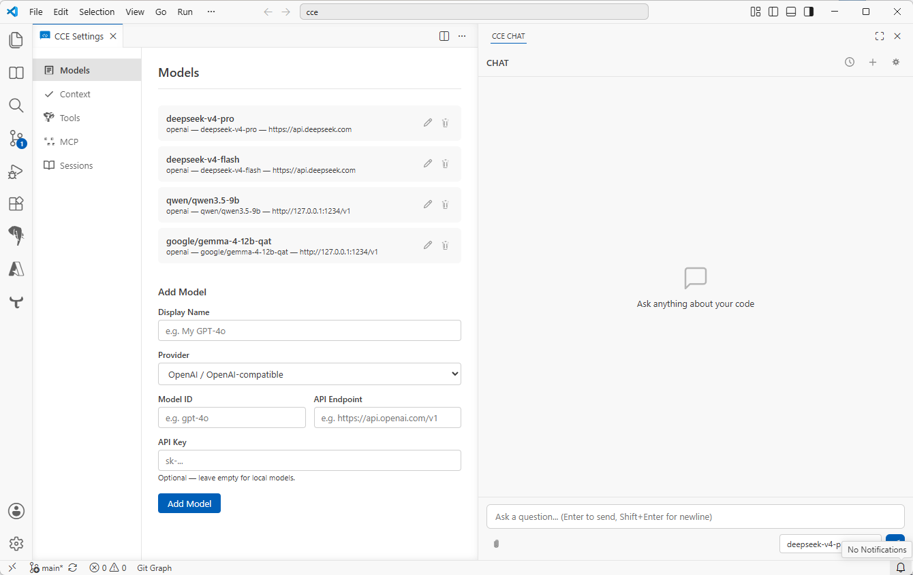

# CCE — Code Chat Extension

A minimal, transparent VSCode chat interface for LLMs. **You decide what gets sent to the model.** No hidden prompts, no magic context — just a clean channel between you and the model, with tools the model can opt into.



## Philosophy

- **Full control.** Which files, selections, and system prompts reach the model is always your choice. Nothing is injected behind your back.
- **Tools are explicit.** Every tool the model can use — read files, search code, run commands — is listed, toggleable, and inspectable. The model must explicitly request each one.
- **Minimal by design.** No framework bloat, no bundler, no abstractions over abstractions. Vanilla JavaScript talking to LLM APIs. What you see is what you get.

## Features

- **Multi-model** — OpenAI, Anthropic, and any OpenAI-compatible endpoint (Ollama, vLLM, LM Studio)
- **Streaming responses** — tokens appear as they're generated
- **Markdown rendering** — code blocks, tables, lists via `marked`
- **Thinking display** — reasoning content in collapsible blocks (o1, o3, DeepSeek-R1, Qwen)
- **Tool calling** — model can read/write files, search code, list directories, run commands, get diagnostics
- **MCP servers** — Model Context Protocol support for external tools (web search, APIs)
- **Agent tool** — spawn parallel sub-agents for independent tasks
- **Sessions** — persistent conversation history with full session management
- **Config panel** — tabbed settings UI for models, context, tools, and MCP servers
- **API keys in OS keychain** — stored via VSCode `SecretStorage` (Windows Credential Manager, macOS Keychain, Linux libsecret)

## Quick Start

### Prerequisites

- [VSCode](https://code.visualstudio.com/) 1.80+
- Node.js 18+

### Install locally

```bash
git clone https://github.com/5im-0n/cce
cd cce
npm install
npx vsce package
```

This creates `cce-0.0.1.vsix`. Install it in VSCode:

```bash
code --install-extension cce-0.0.1.vsix
```

Or via VSCode UI: **Extensions** → `...` → **Install from VSIX...**

### Run in development

Open the project in VSCode and press **F5**. This launches an Extension Development Host with CCE loaded.

## Configuration

Open CCE from the right sidebar. Click the **gear icon** to open settings.

### Models

Add models via **Settings → Models**. Each model needs:

| Field | Description |
|---|---|
| Display Name | Shown in the model dropdown |
| Provider | OpenAI / OpenAI-compatible (Anthropic coming soon) |
| Model ID | API model identifier (e.g. `gpt-4o`, `claude-sonnet-4`) |
| API Endpoint | Base URL (e.g. `https://api.openai.com/v1`) |
| API Key | Optional — leave empty for local models |

The first model added becomes the default.

### Context

Control exactly what the model sees:

- **System Prompt** — custom instructions sent at the start of every conversation
- **Auto-inject** — optional toggles to include date/time, OS, regional settings, and `AGENTS.md`
- **AGENTS.md** — optionally include a project instructions file (default: `AGENTS.md` in workspace root)

Everything is opt-in. The model only sees what you explicitly enable.

### Tools

Enable only the tools you want the model to have access to:

| Tool | Description |
|---|---|
| Read File | Read workspace files with line numbers |
| Write File | Create, overwrite, insert, replace, or delete lines |
| Get Selection | Current editor selection and cursor position |
| Search Code | Ripgrep search with VSCode fallback |
| List Files | Directory listing |
| Get Diagnostics | VSCode errors, warnings, hints |
| Delete File | Remove files or directories |
| Agent | Spawn parallel sub-agents |
| Run Command | Execute shell commands |

All tools are disabled by default. Enable only what you need.

### MCP Servers

Add Model Context Protocol servers via **Settings → MCP**. Each server needs a **URL** and optional custom **headers**. Toggle servers on/off per-session.

## Keyboard Shortcuts

| Key | Action |
|---|---|
| **Enter** | Send message |
| **Shift+Enter** | Newline in input |

## Security

- API keys stored in OS keychain via `vscode.SecretStorage` — never in plaintext files
- Webview never sees API keys
- `run_command` and `delete_files` are available but disabled by default — enable them explicitly in Settings → Tools
- Sub-agents are blocked from spawning more sub-agents (no recursive agent explosion)

## License

MIT
